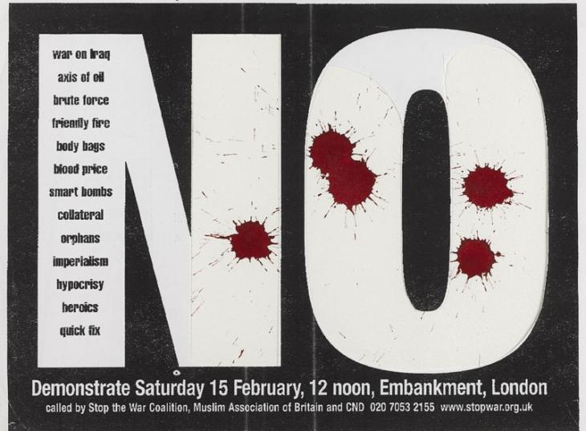
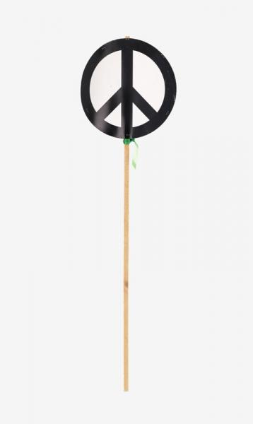
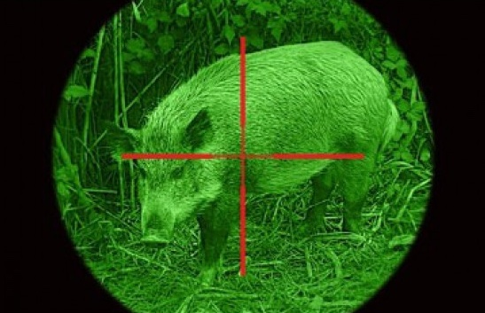

# sshe7280_9103_tut3_asm

#### I. Instructions on how to interact with the work
1. At the beginning, the cursor is a crosshair, which you can use to shoot the dove.
2. Click on the flying doves to shoot. If you hit it, you will see the hit effect of an explosion of the dove feathers and the blood stain on the wall.
3. After you have "killed" three doves, an anti-war effect will be triggered. A large bloodstain and a peace icon will appear in the background. And you are not allowed to shoot doves any more.

#### II. Details of your individual approach to animating the group code.
##### 1. my chosen method: interaction
To better illustrate the theme of binary contrast between war and peace, life and death. Also I want to show that although peace is as fragile as doves, just like the doves on the screen, it will ultimately endure through the time ahd bring lasting hope to humanity.

##### 2. Which properties of the image will be animated and how?
The doves will be animated. To do this I made a dove class and a particles class to make the animation.
See detailed explanation in part 5 below.

##### 3. Group decision:
There's no other group member in my group, so I choose user input because I believe this method would display my inspiration in the best way.

##### 4. References to inspiration for animating your individual code

This poster is based on a placard designed by artist David Gentleman for a major StWC demonstration against war in Iraq in London on 15 February 2003. Gentleman’s use of a succinct slogan and an emotive **blood spot motif** are typical of his work for StWC(Imperial War Museums,2024). 

Artist Gerald Holtom was tasked with designing a symbol for nuclear disarmament to be carried on the march in 1958. His design was printed on lollipop placards like this one, carried by protester Ernest Rodker on the 1958 march and many subsequent protests. Holtom’s symbol rapidly became an icon of the anti-nuclear movement and is now widely referred to as **a general symbol of peace**(Imperial War Museums,2024).

This is a scene of illegal hunting using night vision. In the wilderness, animals have no way to escape from slaughter, even in the darkness of night. This highlights the innocence and vulnerability of the creatures in the face of human firearms and violent force. For me, the wild boar being hunted secretly, unaware of its fate in a few seconds, is a **metaphor for innocent people** involved in the war.
I also drew inspiration from the **crosshair** in this shot, as I believe it implies a sense of **superior gaze** and targeting over the innocent prey.
    
##### 5. Short technical explanation
Overally speaking, my code creates an interactive animation where doves fly across the screen, and when clicked, they explode into particles. Here are my steps.

1. Create a crosshair that moves with the cursor.
    noCursor();
    then made a small icon(mouseX, mouse Y)

2. Main loop:
- setup() and draw():
    - rendering of the background, blood stains, doves, particles, and cursor each frame

3. Create class dove and draw doves that are flying from the left side of the screen to the right side.
- Class dove:
    - Constructor: initializes the dove's position, velocity, size, and generates its shape.
    - Shape Generation: uses scaled vectors to define the dove's shape through a series of triangles.
    - Updating Position: add velocity each frame.
    - Draw the dove or particles depending on isExploded().
    - Explosion Logic: Create particles from dove's triangles.
    - Collision Detection: Checks if the cursor is within the dove's area.

4. Make a explosion effect and a blood stain + peace icon effect while clicking, add a new list that stores data about particles and make each of them smaller and more transparent with time. When they become totally transparent, remove them from the list.
- Class particles:
    - Constructor: Initializes particle properties, including a random direction and speed.
    - Updating Particle State: Moves the particle, reduces its size, and decreases its transparency over time.
    - Draw.
    - Disappearance Check.

##### 6. References
Imperial War Museums. (2024). 7 posters and placards from a      
century of anti-war protest. Retrieved from https://www.iwm.org.uk/history/7-posters-and-placards-from-a-century-of-anti-war-protest

